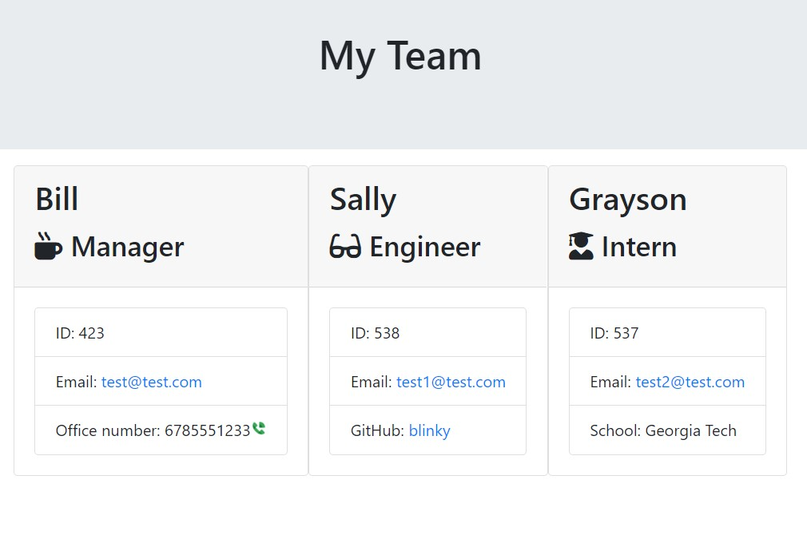

## OOP team profile generator

## Description

This project is a node powered CLI that takes user input to create a website for their team.

## Table of Contents

- [Installation](#installation)
- [Usage](#usage)
- [License](#license)
- [Credits](#credits)
- [Contributing](#contributing)
- [Tests](#tests)
- [Questions](#questions)

## Installation

Make sure you have node installed in your parent folder to run this app.

## Usage

Type "node index.js" in the terminal and press enter. Answer the questions asked about adding new team members and the app will transmit that information to your html file.

## License

MIT License

## Credits

Trey Eckels (Course Instructor) - https://github.com/treyeckels

## Contributing

Clone this code into a new branch and contant me with anything you'd like to commit to main.

## Questions

Email: bnp415@gmail.com
Github: https://github.com/bnicp
